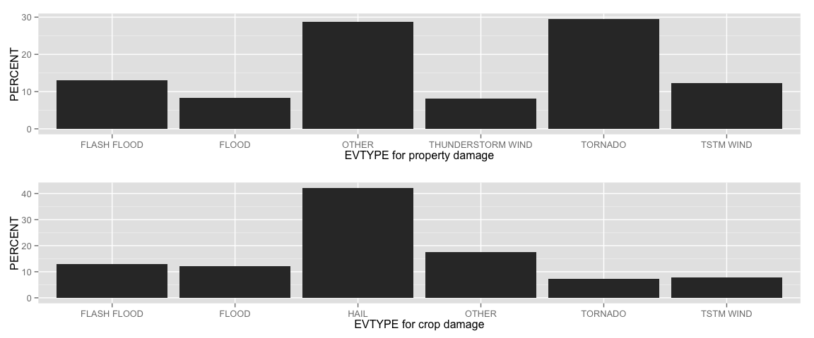

# The Impact of Weather Events on Public Health and the Economy.

## Synopsis

This analysis of more than 900000 storm events show that tornados are the type of event that constitutes the greatest threat to public health and property values. For crop damages hail is the most important type of event.

## Data Processing


```r
# Loads packages.
library(zoo)
```

```
## 
## Attaching package: 'zoo'
## 
## The following objects are masked from 'package:base':
## 
##     as.Date, as.Date.numeric
```

```r
library(xts)
library(ggplot2)
library(grid)
library(scales)
library(knitr)
```

```
## Warning: package 'knitr' was built under R version 3.1.2
```

We start by reading in the Storm Data. The file is in **.csv** format, but it is compressed. Hence vi use the **bzfile()** function to unzip, before we feed the unzipped file into **read.csv()**. This is a moderately large dataset and hence we use the **cache=TRUE**  chunk option on the chunk that reads and organize the data.


```r
## Set wd to local git directory  
setwd("/Users/ag/Dev/gitProjects/StormData")
```


```r
## RUN ONCE
## Read in the compressed raw StormData
StormData <- read.csv(bzfile("repdata-data-StormData.csv.bz2"))
## Check class and names
#class(StormData)
#names(StormData)
## the dataset is quite large so we pick the variables we need
## need  "FATALITIES","INJURIES" for public health and "PROPDMG","CROPDMG" for economic impact
sdRed <- StormData[,c("EVTYPE", "FATALITIES","INJURIES","PROPDMG","CROPDMG")]
rm(StormData)
```

## Analysis of event types impact on public health

We aggregate the data on event type and find the five types that have the greatest impact on fatalities an injuries respectably. All other event types are aggregated in a category called "OTHER". Finally we find the percentage for each of these six categories for both fatalities and injuries.


```r
# aggregate on event type
sdAgg <- aggregate(sdRed[,-1], by=list(sdRed$EVTYPE),FUN=sum, na.rm=TRUE)
names(sdAgg)[1] <- "EVTYPE"
# Find the 5 eventypes that give most fatalities
sdAggF <- sdAgg[order(sdAgg$FATALITIES, decreasing = TRUE),c('EVTYPE', 'FATALITIES')][1:5,]
totF <- sum(sdAgg$FATALITIES)
topFiveF <- sum(sdAggF$FATALITIES)
sdAggF <- rbind(sdAggF,c("OTHER",totF-topFiveF))
sdAggF$PERCENT <- round((as.numeric(sdAggF$FATALITIES)/totF)*100,1)
sdAggF
```

```
##             EVTYPE FATALITIES PERCENT
## 834        TORNADO       5633    37.2
## 130 EXCESSIVE HEAT       1903    12.6
## 153    FLASH FLOOD        978     6.5
## 275           HEAT        937     6.2
## 464      LIGHTNING        816     5.4
## 6            OTHER       4878    32.2
```

```r
# Find the 5 eventypes that give most injuries
sdAggI <- sdAgg[order(sdAgg$INJURIES, decreasing = TRUE),c('EVTYPE', 'INJURIES')][1:5,]
totI <- sum(sdAgg$INJURIES)
topFiveI <- sum(sdAggI$INJURIES)
sdAggI <- rbind(sdAggI,c("OTHER",totI-topFiveI))
sdAggI$PERCENT <- round((as.numeric(sdAggI$INJURIES)/totI)*100,1)
sdAggI
```

```
##             EVTYPE INJURIES PERCENT
## 834        TORNADO    91346    65.0
## 856      TSTM WIND     6957     5.0
## 170          FLOOD     6789     4.8
## 130 EXCESSIVE HEAT     6525     4.6
## 464      LIGHTNING     5230     3.7
## 6            OTHER    23681    16.9
```

In the barplots below the relative importance of the event types are illustrated (One figure, two panels).


```r
p1 <- ggplot(sdAggF, aes(x = EVTYPE, y = PERCENT)) + geom_bar(stat = "identity") + xlab("EVTYPE for FATALITIES")
p2 <- ggplot(sdAggI, aes(x = EVTYPE, y = PERCENT)) + geom_bar(stat = "identity") + xlab("EVTYPE for INJURIES")
#two panels in one figure. The caption is set by fig.cap chunk option
pushViewport(viewport(layout = grid.layout(2, 1)))
print(p1, vp = viewport(layout.pos.row = 1, layout.pos.col = 1))
print(p2, vp = viewport(layout.pos.row = 2, layout.pos.col = 1))
```

 

## Analysis of economic consequences of the most important event types

Again we aggregate the data on event type and find the five types that have the largest economic consequences. The econopmic variables that are present are property damage and crop damage. Since these both are measured in dollars they can also be combinded in a meaningful way to the new variable TOTDMG.


```r
# Find the 5 eventypes that give most proprty damage
sdAggP <- sdAgg[order(sdAgg$PROPDMG, decreasing = TRUE),c('EVTYPE', 'PROPDMG')][1:5,]
totP <- sum(sdAgg$PROPDMG)
topFiveP <- sum(sdAggP$PROPDMG)
sdAggP <- rbind(sdAggP,c("OTHER",totP-topFiveP))
sdAggP$PERCENT <- round((as.numeric(sdAggP$PROPDMG)/totP)*100,1)
sdAggP
```

```
##                EVTYPE    PROPDMG PERCENT
## 834           TORNADO 3212258.16    29.5
## 153       FLASH FLOOD 1420124.59    13.0
## 856         TSTM WIND 1335965.61    12.3
## 170             FLOOD  899938.48     8.3
## 760 THUNDERSTORM WIND  876844.17     8.1
## 6               OTHER    3139369    28.8
```

```r
# Find the 5 eventypes that give most crop damages
sdAggC <- sdAgg[order(sdAgg$CROPDMG, decreasing = TRUE),c('EVTYPE', 'CROPDMG')][1:5,]
totC <- sum(sdAgg$CROPDMG)
topFiveC <- sum(sdAggC$CROPDMG)
sdAggC <- rbind(sdAggC,c("OTHER",totC-topFiveC))
sdAggC$PERCENT <- round((as.numeric(sdAggC$CROPDMG)/totC)*100,1)
sdAggC
```

```
##          EVTYPE   CROPDMG PERCENT
## 244        HAIL 579596.28    42.1
## 153 FLASH FLOOD 179200.46    13.0
## 170       FLOOD 168037.88    12.2
## 856   TSTM WIND  109202.6     7.9
## 834     TORNADO 100018.52     7.3
## 6         OTHER 241771.58    17.5
```

In the barplots below the economic consequence of the event types are illustrated (One figure, two panels). We see that tornados does a lot of property damage while hail is the most important factor for crop damgages. Other important factors that have large economic consequences are flooding and strong wind. It is worth to note the importance of hail for crop damages.


```r
p3 <- ggplot(sdAggP, aes(x = EVTYPE, y = PERCENT)) + geom_bar(stat = "identity") + xlab("EVTYPE for property damage")
p4 <- ggplot(sdAggC, aes(x = EVTYPE, y = PERCENT)) + geom_bar(stat = "identity") + xlab("EVTYPE for crop damage")
#two panels in one figure. The caption is set by fig.cap chunk option
pushViewport(viewport(layout = grid.layout(2, 1)))
print(p3, vp = viewport(layout.pos.row = 1, layout.pos.col = 1))
print(p4, vp = viewport(layout.pos.row = 2, layout.pos.col = 1))
```

 

We then finally turn to the total economic consequences and find total damage. As seen from the table hail is only fourth on this list. The reason is that total cost of property damages is much bigger than the total cost of crop damages. 


```r
sdAgg$TOTDMG <- sdAgg$PROPDMG + sdAgg$CROPDMG
sdAggT <- sdAgg[order(sdAgg$TOTDMG, decreasing = TRUE),c('EVTYPE', 'TOTDMG')][1:5,]
totT <- sum(sdAgg$TOTDMG)
topFiveT <- sum(sdAggT$TOTDMG)
sdAggT <- rbind(sdAggT,c("OTHER",totT-topFiveT))
sdAggT$PERCENT <- round((as.numeric(sdAggT$TOTDMG)/totT)*100,1)
sdAggT
```

```
##          EVTYPE     TOTDMG PERCENT
## 834     TORNADO 3312276.68    27.0
## 153 FLASH FLOOD 1599325.05    13.0
## 856   TSTM WIND 1445168.21    11.8
## 244        HAIL 1268289.66    10.3
## 170       FLOOD 1067976.36     8.7
## 6         OTHER 3569291.37    29.1
```

## Results

This analysis show that tornados is the kind of storm event that has the greatest impact on public health and property damages. Flooding is an event type that is important both for public health and property damage. For public health excessive heat is an important event type, while strong wind is of greater importance for property damage. For crop damage hail turns out to be the main culprit followed by flooding and strong wind. When we turn to total economic damage we see that hail is only fourth on this list. The top three are tornados, flooding and strong wind.
